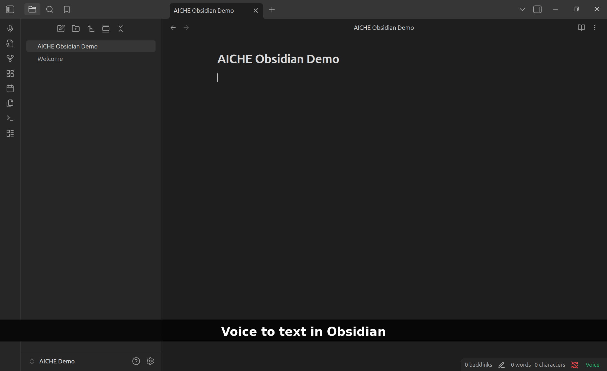
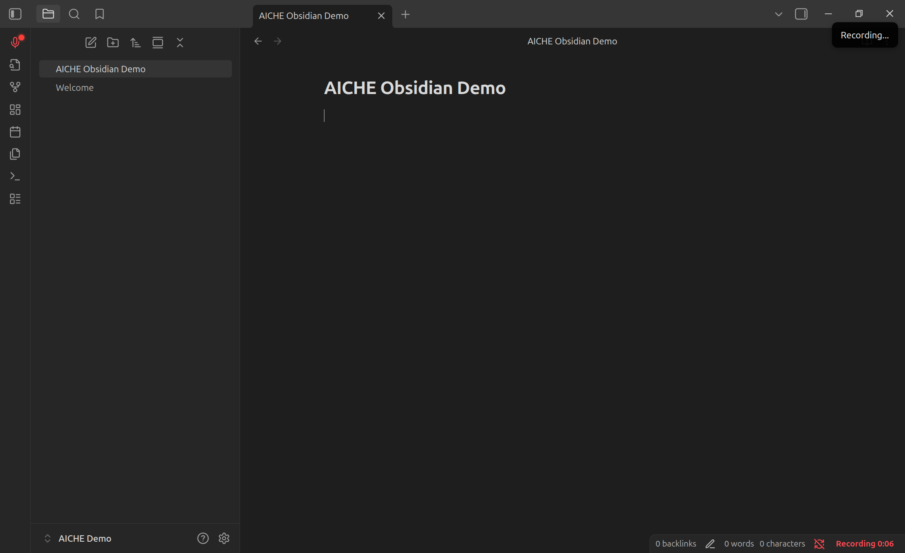
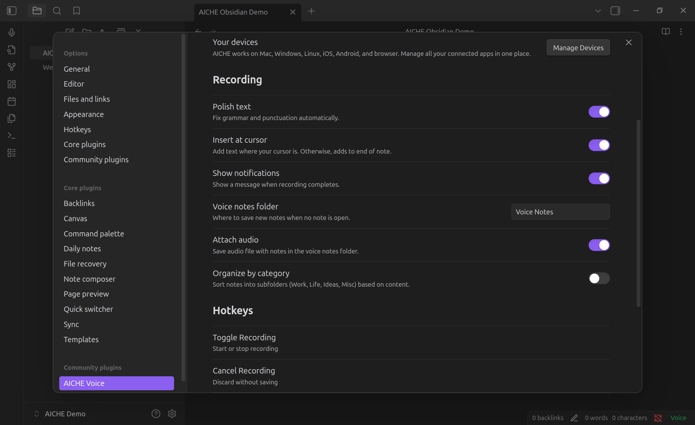

# AICHE Voice for Obsidian

Speak into your notes. Polished text in seconds.

Part of [AICHE](https://aiche.app) — one subscription, voice-to-text everywhere: desktop apps, Obsidian, mobile, browser.

## What It Does

Press record, speak naturally, get clean text with grammar and punctuation handled. Not raw transcription — readable sentences.

## Install

**Community Plugins**
1. Settings → Community Plugins → Browse
2. Search "AICHE Voice"
3. Install → Enable

**Manual**
1. Download latest release
2. Extract to `.obsidian/plugins/aiche-voice/`
3. Enable in Community Plugins

## Setup

1. Settings → AICHE Voice → Sign In
2. Authenticate in browser
3. Start recording

## Usage

| Method | Action |
|--------|--------|
| Ribbon | Click microphone icon |
| Hotkey | Settings → Hotkeys → search "AICHE" |
| Command | `Ctrl/Cmd + P` → "Toggle Recording" |
| Status Bar | Click indicator, right-click for menu |

## Settings

| Option | Description |
|--------|-------------|
| Polish text | Grammar and punctuation cleanup |
| Insert at cursor | Text at cursor vs end of note |
| Notifications | Show completion notices |
| Voice notes folder | Auto-created notes location |
| Attach audio | Embed audio with voice notes |
| Category folders | Organize into Work/Life/Ideas/Misc |

## Privacy

Audio sent to AICHE servers, deleted immediately after transcription. Zero retention.

- Audio: processed and purged (not stored)
- Text: stored with your account
- Offline: encrypted locally (AES-GCM), deleted after upload

[Privacy Policy](https://aiche.app/privacy)

## Pricing

One AICHE subscription works everywhere — desktop, Obsidian, mobile, browser.

7-day free trial. $4.99/month.

[Start Free Trial](https://aiche.app)

## Support

- [Website](https://aiche.app)
- [Help](https://aiche.app/help)
- [Issues](https://github.com/AICHE-app/obsidian/issues)

## License

MIT
